 

<a href="#-español">🇪🇸 Español</a> &nbsp;·&nbsp; <a href="#-english">🇬🇧 English</a>

## 🇪🇸 Español

### Sobre mí

Técnico informático con formación reglada en sistemas y manejo de entornos digitales. Perfil
**responsable, organizado y metódico**, especializado en la gestión de datos, la resolución de
incidencias informáticas y la aplicación rigurosa de protocolos operativos. Trabajo con autonomía,
puntualidad y rápida adaptación a flujos de equipo.

Fuera del día a día, construyo y publico **herramientas propias** de automatización y tratamiento de
datos: proyectos reales, con tests, documentación y licencia, para que quien los use confíe en lo
que hace el programa.

### Competencias

- **🖥️ Sistemas y soporte** — Mantenimiento hardware/software · instalación y configuración de Windows/Linux · redes locales · resolución de incidencias de Nivel 1.
- **🗂️ Datos y ofimática** — Procesamiento y organización de archivos masivos · actualización de bases de datos · verificación de datos web · ofimática avanzada y herramientas de IA.
- **🛡️ Operativa y protocolos** — Supervisión de accesos · gestión de incidencias · atención y registro de usuarios · cumplimiento de normativas de seguridad.
- **🌐 Idiomas** — Español (nativo) · Inglés técnico (comprensión fluida de documentación y lectura).

### Proyectos destacados

Tres desarrollos autónomos, publicados y mantenidos. Cada uno resuelve un problema concreto desde una
óptica distinta de mi perfil: **datos, automatización y rendimiento**.

#### 🔎 [LocalGrant-Finder](https://github.com/yosoyignicion/LocalGrant-Finder)
*Python · FastAPI · pgvector · SQLite / PostgreSQL · Docker*

Convierte el BOE en decisiones de financiación: ingiere y normaliza subvenciones públicas, las busca
con búsqueda híbrida (BM25 + semántica) y les da seguimiento por fases.

`69 tests` · `CI en verde` · `migraciones Alembic` · `funciona sin red ni API keys`

#### 🧾 [SystemBridge-AI](https://github.com/yosoyignicion/SystemBridge-AI)
*Python · FastAPI · OCR · LLM local · Docker*

Transforma facturas, tickets y escaneos en un libro contable equilibrado y auditable: lee con reglas
deterministas y OCR, valida cada total y envía lo dudoso a revisión humana.

`71 tests` · `métricas Prometheus` · `dinero en Decimal, nunca float` · `idempotente`

#### 🖼️ [AssetShrink](https://github.com/yosoyignicion/AssetShrink)
*C++17 · WebP · CMake · Multiplataforma*

Comprime y convierte imágenes en lote, al 100% en local y sin subir nada a servidores. Motor
multihilo, comparador visual y binario listo para Linux, macOS y Windows.

`release v1.0.0` · `CI en 3 sistemas` · `1 ⭐`

### Herramientas

`Windows` · `Linux` · `Redes locales` · `Ofimática avanzada` · `Python` · `FastAPI` · `SQL` · `Git` ·
`Docker` · `Automatización` · `IA aplicada`

### ¿Trabajamos juntos?

Si has llegado hasta aquí, ya sabes cómo trabajo: **con método, con tests y sin promesas que no pueda
sostener**. Busco un equipo donde aportar esa base sólida de sistemas y datos, y seguir creciendo
rodeado de gente que cuida el detalle. Si tu proyecto necesita a alguien puntual, ordenado y con
muchas ganas de aprender —o solo quieres contrastar una idea— escríbeme. Respondo siempre, y con
gusto.

### Contacto

| | |
| :--- | :--- |
| ✉️ **Email** | [nbrbadenes99@gmail.com](mailto:nbrbadenes99@gmail.com) |
| 💼 **LinkedIn** | [linkedin.com/in/ignacio-badenes](https://linkedin.com/in/ignacio-badenes) |
| 🐦 **X** | [@YosoyIgnicion](https://x.com/YosoyIgnicion) |
| 📄 **CV** | [Descargar CV (PDF)](./CV_Ignacio_Badenes_Tecnico.pdf) |

📍 Castellón de la Plana, España

<a href="#-english">🇬🇧 Continue in English →</a>

## 🇬🇧 English

### About me

IT technician with formal training in systems and digital environments. A **responsible, organised
and methodical** profile, focused on data handling, incident resolution and the rigorous application
of operational protocols. I work autonomously, on time, and adapt quickly to team workflows.

Beyond the day job, I build and publish **my own tools** for automation and data processing: real
projects with tests, documentation and a licence, so whoever uses them can trust what the software
does.

### Skills

- **🖥️ Systems & support** — Hardware/software maintenance · Windows/Linux setup · local networks · Level 1 incident resolution.
- **🗂️ Data & office** — Bulk file processing and organisation · database updates · web data verification · advanced office suites and AI tools.
- **🛡️ Operations & protocols** — Access supervision · incident management · user attention and registration · security regulation compliance.
- **🌐 Languages** — Spanish (native) · Technical English (fluent reading of documentation).

### Featured projects

Three self-driven builds, published and maintained. Each one solves a concrete problem from a
different angle of my profile: **data, automation and performance**.

#### 🔎 [LocalGrant-Finder](https://github.com/yosoyignicion/LocalGrant-Finder)
*Python · FastAPI · pgvector · SQLite / PostgreSQL · Docker*

Turns the Spanish official gazette (BOE) into funding decisions: it ingests and normalises public
subsidies, searches them with hybrid retrieval (BM25 + semantic) and tracks them through stages.

`69 tests` · `green CI` · `Alembic migrations` · `runs offline, no API keys`

#### 🧾 [SystemBridge-AI](https://github.com/yosoyignicion/SystemBridge-AI)
*Python · FastAPI · OCR · local LLM · Docker*

Turns invoices, receipts and scans into a balanced, audit-ready ledger: reads with deterministic
rules and OCR, validates every total and routes anything doubtful to human review.

`71 tests` · `Prometheus metrics` · `money as Decimal, never float` · `idempotent`

#### 🖼️ [AssetShrink](https://github.com/yosoyignicion/AssetShrink)
*C++17 · WebP · CMake · Cross-platform*

Compresses and converts images in bulk, 100% locally and without uploading anything to a server.
Multithreaded engine, visual comparator and binaries for Linux, macOS and Windows.

`release v1.0.0` · `CI on 3 systems` · `1 ⭐`

### Toolbox

`Windows` · `Linux` · `Local networks` · `Advanced office suites` · `Python` · `FastAPI` · `SQL` ·
`Git` · `Docker` · `Automation` · `Applied AI`

### Let's work together?

If you've read this far, you already know how I work: **methodically, with tests and without
promises I can't keep**. I'm looking for a team where I can bring that solid grounding in systems
and data, and keep growing alongside people who care about the details. If your project needs
someone punctual, organised and genuinely eager to learn —or you just want to bounce an idea— write
to me. I always reply, and gladly.

### Contact

| | |
| :--- | :--- |
| ✉️ **Email** | [nbrbadenes99@gmail.com](mailto:nbrbadenes99@gmail.com) |
| 💼 **LinkedIn** | [linkedin.com/in/ignacio-badenes](https://linkedin.com/in/ignacio-badenes) |
| 🐦 **X** | [@YosoyIgnicion](https://x.com/YosoyIgnicion) |
| 📄 **CV** | [Download CV (PDF)](./CV_Ignacio_Badenes_Tecnico.pdf) |

📍 Castellón de la Plana, Spain

Perfil de <strong>Ignacio Badenes</strong> · <a href="https://github.com/yosoyignicion">github.com/yosoyignicion</a> · Castellón de la Plana, España

